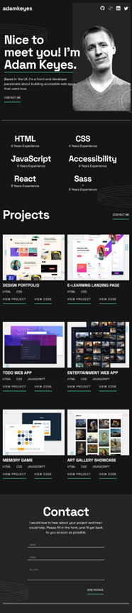
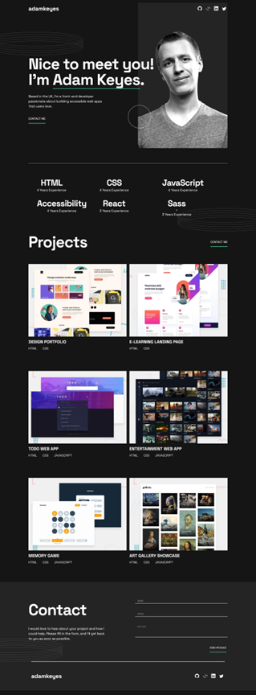

# Frontend Mentor - Single-page developer portfolio solution

This is a solution to the [Single-page developer portfolio challenge on Frontend Mentor](https://www.frontendmentor.io/challenges/singlepage-developer-portfolio-bBVj2ZPi-x). Frontend Mentor challenges help you improve your coding skills by building realistic projects. 

## Overview

### The challenge

Users should be able to:

- Receive an error message when the `form` is submitted if:
  - Any field is empty
  - The email address is not formatted correctly
- View the optimal layout for the interface depending on their device's screen size
- See hover and focus states for all interactive elements on the page

### Screenshot

### Links

- Solution URL: [https://github.com/toshirokubota/single-page-developer-portfolio](https://github.com/toshirokubota/single-page-developer-portfolio)
- Live Site URL: [https://toshirokubota.github.io/single-page-developer-portfolio/](https://toshirokubota.github.io/single-page-developer-portfolio/)

## My process

### Built with

- Semantic HTML5 markup
- CSS custom properties
- Flexbox
- CSS Grid
- Mobile-first workflow

### What I learned

- I managed to include a svg patter as a part of the background. I had some difficuty in controlling the placement. Using the percentage was not working and I had to use px instead. 

- I tried to do most of the form validation with css. Only part that I did with javascript was to enable/disable the submit button.

- Inserting an exclamation icon in one of input boxes was done ad-hoc with absolute positioning. I would like to know a better approach, but that was an easy way out.

- This is something I did not learn and want to learn more about it. It was not clear to me how to handle hidden/visible elements from the ARIA perspectives.

### Continued development

I was not able to do a bonus challenge to store the user's enquiry. I wanted to, but since I have never used Airtable or interfacing with a spreadsheet, I decided to skip it for now. I also thought it would be too much to set up the backend and handle the post request (Isn’t it what I have to do?). Hopefully, it will become straightforward soon.

### Useful resources

- [CSS filter generator to convert from black to target hex color](https://codepen.io/sosuke/pen/Pjoqqp) - I used this site to find the filter needed to change the color of the icons in hover/focus states.

## Author

## Acknowledgments
